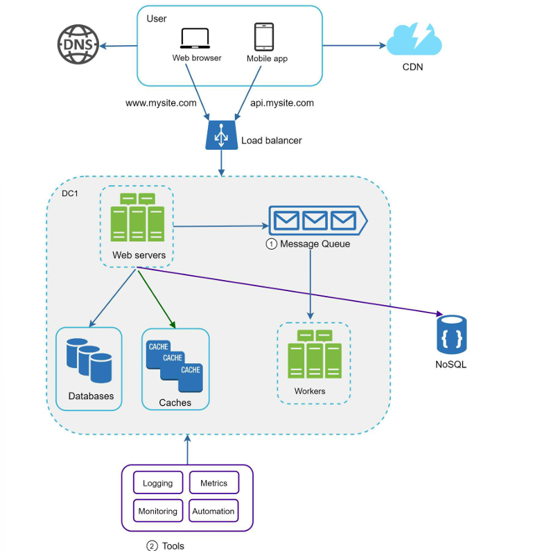

# 🏗️ High-Level System Design Components

This document explains the core components of a scalable web application architecture. It is intended for interview preparation and understanding how modern backend systems are designed.

---

## 📌 Architecture Diagram

> Add your architecture image here.

```text
README.md
├── architecture.png
└── README.md
```

Then display it using:

```md

```

---

# 🌐 1. User (Web Browser / Mobile App)

## What is it?

The **User** is the client interacting with the application. It can be:

- Web Browser (Chrome, Firefox, Safari)
- Mobile App (Android/iOS)
- Desktop Application

Example API Requests:

```http
GET /products/15
```

```http
POST /login
```

## Why do we need it?

Every application starts with a request from a user. Users interact with the application to retrieve data or perform actions.

## Interview Explanation

> The user is the entry point of the system. It sends HTTP requests through a browser or mobile application. Before reaching our backend, the request must first resolve the domain using DNS.

---

# 🌍 2. DNS (Domain Name System)

## What is it?

DNS converts a human-readable domain name into an IP address.

Example

```
amazon.com
      ↓
54.239.xxx.xxx
```

Instead of remembering IP addresses, users simply type the website name.

## Why do we need it?

Humans can easily remember names but computers communicate using IP addresses.

## Real-Life Example

```
youtube.com
      ↓
142.250.xxx.xxx
```

## Interview Explanation

> DNS resolves a domain name into an IP address so the client knows where to send the request.

---

# 🚀 3. CDN (Content Delivery Network)

## What is it?

A CDN stores copies of static content across multiple geographical locations.

Without CDN

```
India
   ↓
USA Server
   ↓
Image Download
```

With CDN

```
India
   ↓
Mumbai CDN
   ↓
Image Download
```

## What does a CDN store?

✅ Images

✅ CSS

✅ JavaScript

✅ Fonts

✅ Videos

❌ Login APIs

❌ Payment APIs

❌ Database Queries

## Why do we need it?

- Faster content delivery
- Reduced latency
- Lower load on backend servers
- Better user experience

## Real-Life Examples

- Instagram Profile Pictures
- Netflix Posters
- Amazon Product Images

## Interview Explanation

> A CDN caches static assets close to users, reducing latency and decreasing the load on the origin servers.

---

# ⚖️ 4. Load Balancer

## What is it?

A Load Balancer distributes incoming traffic across multiple backend servers.

Without Load Balancer

```
10,000 Users
      ↓
 One Server
```

If that server crashes, the application becomes unavailable.

With Load Balancer

```
Users
   ↓
Load Balancer
   ↓
Server A
Server B
Server C
```

## Why do we need it?

- High Availability
- Horizontal Scaling
- Fault Tolerance
- Prevent Server Overload

## Popular Load Balancers

- NGINX
- HAProxy
- AWS ALB

## Interview Explanation

> A Load Balancer distributes requests across multiple servers, ensuring scalability and high availability.

---

# 💻 5. Web Servers

## What are they?

Web servers host the backend application and execute business logic.

Examples

- FastAPI
- Spring Boot
- ASP.NET Core
- Node.js
- Django

Example Flow

```
Client Request
      ↓
Validate Request
      ↓
Business Logic
      ↓
Cache / Database
      ↓
Return Response
```

## Responsibilities

- Handle API requests
- Validate input
- Execute business logic
- Communicate with databases
- Return responses

## Interview Explanation

> Web servers execute business logic and coordinate communication between clients, databases, caches, and external services.

---

# 🗄️ 6. Database

## What is it?

A Database stores permanent and structured application data.

Examples

- Users
- Orders
- Payments
- Products
- Comments

Popular SQL Databases

- PostgreSQL
- MySQL
- SQL Server
- Oracle

Example Query

```sql
SELECT *
FROM Users
WHERE Id = 15;
```

## Why do we need it?

To store reliable and persistent data.

## Use Cases

- Banking
- E-Commerce
- Payment Systems
- Inventory

## Interview Explanation

> Relational databases provide ACID transactions and ensure data consistency for structured information.

---

# ⚡ 7. Cache

## What is it?

A cache stores frequently accessed data in memory.

Without Cache

```
User
 ↓
Database
```

With Cache

```
User
 ↓
Cache
 ↓
Database (Only on Cache Miss)
```

Popular Technologies

- Redis
- Memcached

## Benefits

- Faster Responses
- Reduced Database Load
- Improved Scalability

## Real-Life Examples

- Homepage Data
- Trending Products
- User Sessions

## Interview Explanation

> Cache stores frequently accessed data in memory to reduce database load and improve response times.

---

# 📨 8. Message Queue

## What is it?

A Message Queue allows long-running tasks to be processed asynchronously.

Imagine a user uploads a video.

Instead of making the user wait several minutes while the video is processed, the application places the task into a **Message Queue**, immediately returns a success response, and lets a background worker process it later.

Flow

```
User Uploads Video
        ↓
Web Server
        ↓
Message Queue
        ↓
200 OK
        ↓
Worker Processes Video
```

Popular Technologies

- RabbitMQ
- Apache Kafka
- Amazon SQS
- Azure Service Bus

## Use Cases

- Sending Emails
- SMS Notifications
- Video Processing
- Image Resizing
- PDF Generation
- Payment Confirmation

## Interview Explanation

> A Message Queue decouples services by allowing long-running tasks to execute asynchronously without blocking the user's request.

---

# 👷 9. Workers

## What are they?

Workers continuously listen to the Message Queue and execute background jobs.

Example

```
Queue
 ↓
Send Email
 ↓
Worker
 ↓
Email Delivered
```

## Responsibilities

- Process queued tasks
- Retry failed jobs
- Execute background operations

## Interview Explanation

> Workers improve user experience by processing asynchronous tasks in the background.

---

# 📄 10. NoSQL Database

## What is it?

NoSQL databases store unstructured or semi-structured data.

Popular Databases

- MongoDB
- Cassandra
- DynamoDB

## Use Cases

- Chat Applications
- Social Media Posts
- Analytics
- IoT Devices

## Why NoSQL?

Different records can have different structures.

Example

```
Post 1
Text

Post 2
Text
Images

Post 3
Text
Video
Poll
```

## Interview Explanation

> NoSQL databases provide schema flexibility and horizontal scalability for large-scale applications.

---

# 📜 11. Logging

## What is it?

Logging records application events and errors.

Example

```
INFO    User Logged In
WARNING Invalid Token
ERROR   Database Timeout
```

Popular Tools

- ELK Stack
- Grafana Loki
- Splunk

## Interview Explanation

> Logging helps developers debug issues and audit application behavior.

---

# 📊 12. Metrics

## What are Metrics?

Metrics measure the health and performance of an application.

Examples

- CPU Usage
- Memory Usage
- Requests per Second
- Error Rate
- Response Time

Popular Tools

- Prometheus
- Grafana
- AWS CloudWatch

## Interview Explanation

> Metrics provide quantitative insights into application performance and health.

---

# 🔍 13. Monitoring

## What is Monitoring?

Monitoring continuously watches application metrics and sends alerts whenever something goes wrong.

Example

```
CPU > 90%
      ↓
Alert
```

Popular Tools

- Grafana
- Datadog
- New Relic
- Prometheus Alertmanager

## Interview Explanation

> Monitoring proactively detects issues and notifies engineers before they impact users.

---

# 🤖 14. Automation

## What is Automation?

Automation eliminates repetitive manual work.

Examples

- CI/CD Deployments
- Auto Scaling
- Database Backups
- Infrastructure Provisioning

Popular Tools

- Kubernetes
- Terraform
- Jenkins
- GitHub Actions
- Ansible

## Interview Explanation

> Automation improves consistency, reduces human error, and speeds up deployments and recovery.

---

# 🔄 Complete Request Flow

```
User
   ↓
DNS
   ↓
CDN (Static Content)
   ↓
Load Balancer
   ↓
Web Server
   ↓
Cache
   ↓
Database
   ↓
Message Queue (if asynchronous work is required)
   ↓
Workers
```

Meanwhile,

- Logging records application events.
- Metrics collect performance data.
- Monitoring watches system health.
- Automation manages deployments and scaling.

---

# 🎯 Interview Summary

| Component | One-Line Explanation |
|-----------|----------------------|
| User | Sends requests to the application. |
| DNS | Resolves domain names to IP addresses. |
| CDN | Delivers static content from nearby servers. |
| Load Balancer | Distributes traffic across multiple servers. |
| Web Server | Executes business logic and handles requests. |
| Database | Stores structured, persistent data. |
| Cache | Stores frequently accessed data in memory. |
| Message Queue | Handles asynchronous tasks. |
| Worker | Processes background jobs from the queue. |
| NoSQL | Stores flexible, large-scale data. |
| Logging | Records events and errors. |
| Metrics | Measures system performance. |
| Monitoring | Detects issues and raises alerts. |
| Automation | Automates deployments and infrastructure tasks. |
